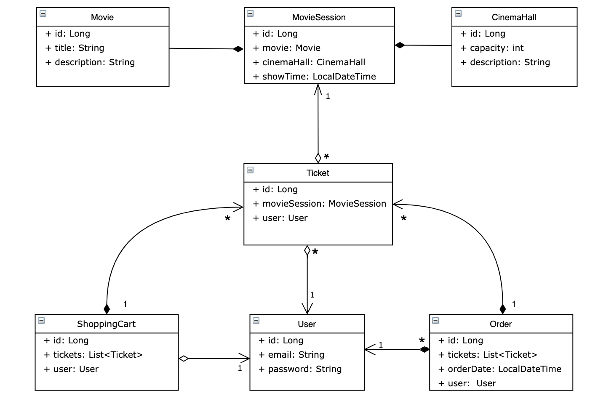

# 🎬  Cinema-application project 🎥

 👀  ****Project description:****

Simple back - end application, that follows REST-full API rules and supports user authentication, authorization as well as various CRUD operations. Created using Spring & Hibernate.

****Project functionality:****

Here is the scheme of this app to better understand its functionality:

****Project's structure:****

* config - contains config classes required by Spring & Hibernate
* controller - all http controllers
* dao - classes responsible for crud operations with db
* dto - used for http requests and responses
* exception - custom exceptions
* lib - custom validators for email, password and confirm password
* model - model classes for entities shown in scheme above
* service - classes that are responsible for business logic and connecting dao with controllers
* service/mapper - mappers that are used to parse dto to entity and entity to dto
* util - util class containing date pattern to parse date from json 

 📝 ****Technologies:****

* Java 19
* Spring Web MVC
* Spring Security
* Hibernate
* MySql
* Tomcat 9
* Maven

 💻****Steps to run the app:****

* Clone this repo;
* Install MySQL;
* Configure Apache Tomcat version: 9;
* Run "mvn clean package" command in terminal;
* Start Tomcat.

🚀  Run and use application!  

